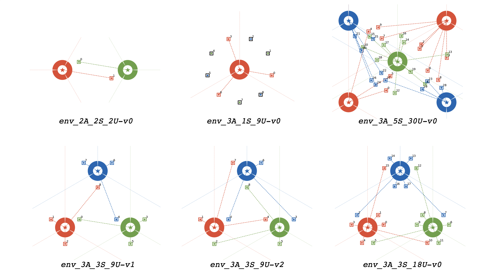

#Gym Environments for Telecom Providers Cooperation


## How to INSTALL gym environments :
1. Install the OpenAI gym Python package (for example with `pip`) :
    ```bash
    pip install gym
    ```

1. Clone this project:
    ```bash
    git clone https://github.com/tlgleo/gym-MNOs-cooperation.git
    ```

2. To install Gym environments : in the root folder `gym-MNOs-cooperation`, run:
    ```bash
    pip install -e .
    ```
    Important : This has to be done each time a new environment is created 

## Preset Environments :
This project already provides some environments:
#### With two agents:
- `env_2A_2S_2U-v0` : 2 agents, 2 sites, 2 users
#### With three agents:
- `env_3A_3S_9U-v1` : 3 agents, 3 sites, 9 users (with circular cooperation)
- `env_3A_3S_9U-v2` : 3 agents, 3 sites, 9 users (with symmetrical cooperation)
- `env_3A_3S_18U-v0` : 3 agents, 3 site, 18 users
- `env_3A_1S_9U-v0` : 3 agents, 1 site, 9 users
- `env_3A_5S_30U-v0` : 3 agents, 5 sites, 30 users (Random users positions)




## How to create a environment :
1. in the file `multi_agents_mno/envs/custom_env_template.py` :

    a. Choose a name for the class instead of `Name_Of_Env_Class`. For example : `Env_4A_8S_20U`
       
    b. Modify the features of the class : positions of users, sites (see paper for further details)
    
1. in the file `multi_agents_mno/envs/__init__.py` :

    2.1 import the class of your environment : 
        you have to modify `Name_Of_Env_Class` with the name chosen in 1.a in the template line : 
    ```python
    from multi_agents_mno.envs.custom_env_template import Name_Of_Env_Class
    ```
        
3. in the file `multi_agents_mno/__init__.py` :

    a. Chose a name for your env, with the form `name_of_env-v123` ( IMPORTANT : finished by -vXY, with XY a number )
    for example `env_with_3_agents-v0`, `draft-v12` etc
    
    b. 
    modify `name_of_env-v123` by the name chosen in 3.a AND `Name_Of_Env_Class` by the name chosen in 1.a
    in the template line : 
    ```python
    register(id='name_of_env-vXY', entry_point = 'multi_agents_mno.envs:Name_Of_Env_Class')
    ```

4. Finish the environment installation with running in the root folder :
    ```bash
    pip install -e .
    ```


## How to Work with Gym:
In the file `Main_gym_MNO.ipynb`, some interaction example with environments are provided. 

#### Create an environment
To create an environment, use :
```python
env = gym.make(name_of_env-v123)
```

#### Display
To display and save figure of current environment, use :
```python
env.render('output.png') 
```
    
#### Actions 
The main function of Gym toolkit is the action function.
To execute an action, run : 
```python
obs_n, r_n, done_n, info = env.step(actions_n)
```
The input `actions_n` is a list of agents actions where a individual action is a `numpy` of shape : `n_sites`, `n_sections`, `n_agents` (see the paper for further details)

The outputs are:
- `obs_n`: list of agents observations
- `r_n`: list of agents rewards 
- `done_n`: list of agent game termination (Boolean: True if game is over)
- `info`: Optional additional information
